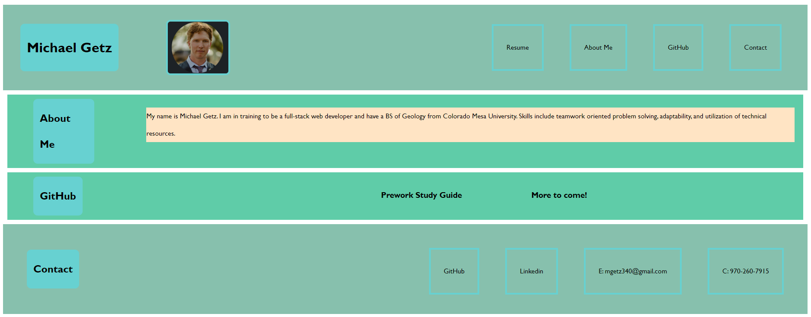

# Professional Portfolio

## Description
The purpose of this project was to build a professional portfolio to display our skills in mastering CSS and HTML layouts and formatting. 
The project was built not only as a homework assignment, but as an actual portfolio to be updated and polished over the course of the class and to use in a job search in the future.
This project helps to centralize projects completed and to paint a picture of the quality of work that can be produced. 
HTML formatting, CSS stying, and media queries were used to optimize a static webpage with links. This project was excellent practice for these basics of web development, and will be revisited throughout the course of the next few months. 

## Installation

N/A

## Usage

## Credits

N/A

## License

N/A

## Application link

[Professional Portfolio Michael Getz](https://mgetz34.github.io/professional-portfolio/)
